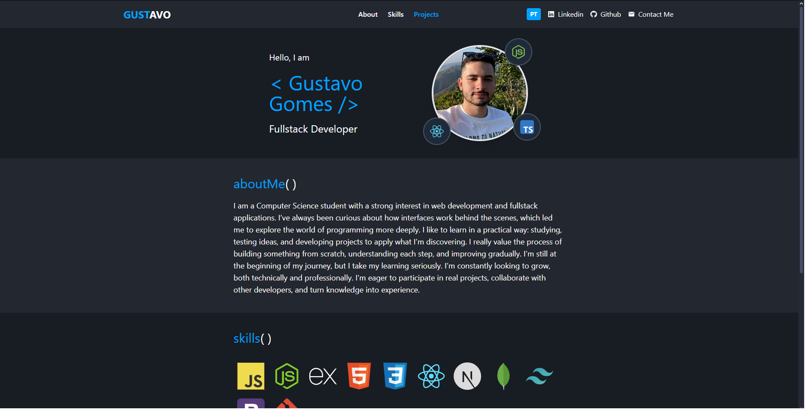

# Portfolio | Gustavo Gomes

[🇧🇷 Versão em português](./README.md)

This is my personal portfolio as a Fullstack Developer, built to showcase my projects, skills, and journey as a Computer Science student.

📍 **Tech stack**:  
JavaScript · Next.js (App Router) · React · Tailwind CSS

🌍 **Available languages**:  
Portuguese 🇧🇷 and English 🇺🇸 (manual translation with language toggle)

📱 **Responsive design**:  
Adapts to all screen sizes with a hamburger menu on mobile.

🔗 **Live preview**:  
👉 [Visit portfolio](https://portfolio-snowy-one-33.vercel.app/en)

---

## 🧩 Page sections

- **About me** – a brief introduction and professional goals  
- **Skills** – main technologies I’m learning and practicing  
- **Projects** – a list of personal projects focused on web applications

---

## 🎯 Purpose

I built this portfolio to showcase my progress as a developer and introduce myself professionally.  
I’m looking for opportunities to work on real projects, collaborate with other developers, and turn knowledge into experience.
