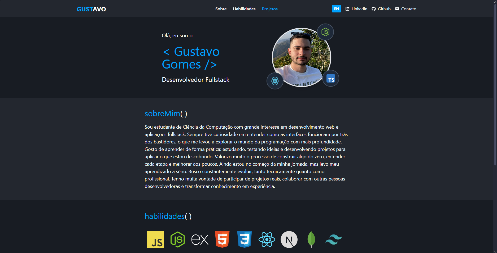

# Portfólio | Gustavo Gomes

[🇺🇸 English version](./README.en.md)

Este é o meu portfólio pessoal como desenvolvedor Fullstack, criado para apresentar meus projetos, habilidades e trajetória como estudante de Ciência da Computação.

📍 **Tecnologias usadas**:  
JavaScript · Next.js (App Router) · React · Tailwind CSS

🌍 **Idiomas disponíveis**:  
Português 🇧🇷 e Inglês 🇺🇸 (suporte a múltiplos idiomas com troca via botão)

📱 **Responsivo**:  
O design se adapta a diferentes tamanhos de tela, com menu hambúrguer no mobile.

🔗 **Preview online**:  
👉 [Acessar portfólio](https://portfolio-snowy-one-33.vercel.app)

---

## 🧩 Seções da página

- **Sobre mim** – breve introdução e objetivos profissionais  
- **Habilidades** – principais tecnologias que estou aprendendo e praticando  
- **Projetos** – lista de projetos pessoais com foco em aplicações web

---

## 🎯 Objetivo

Criei este portfólio para demonstrar meu progresso como desenvolvedor e me apresentar profissionalmente. Estou em busca de oportunidades para colaborar em projetos reais, aprender com outras pessoas desenvolvedoras e crescer na área de tecnologia.
